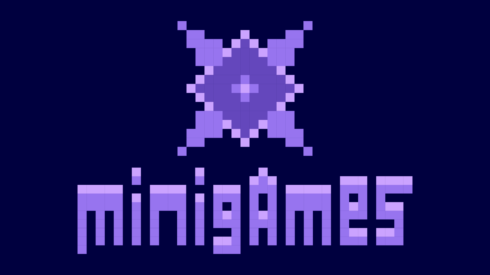
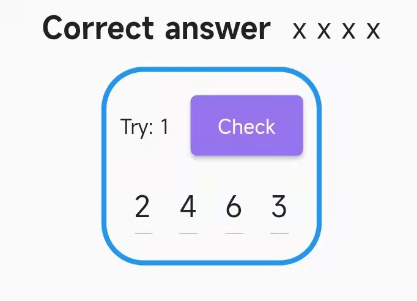
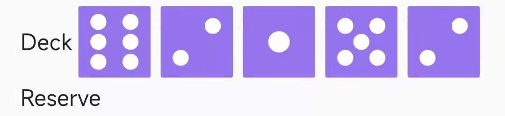

    
    
    
    
    

Mini games collection written in Dart & Flutter! 

# Games
## Hit & Blow
Hit & Blow is inspired by Nintendo Switch's Clubhouse Games: 51 Worldwide Classics' Hit & Blow.

### Description
This is a game of guessing the hidden `n` numbers and positions, with the default `n` being 4. Select `n-2` numbers from 1 to n and place them in the positions, then press "Check" to check for correctness. Each position will be judged as "all correct" (indicated by colored check marks) or "half correct" (indicated by grey check marks), the number of former is the number of correct positions and numbers, the number of latter is the number of correct numbers. If it fails, you can try again until you get it right! 

### Further Objects
- Leaderboard

## Simple Dice Game
Simple Dice Game inspired by Nintendo Switch's Clubhouse Games: 51 Worldwide Classics' Yacht Dices.

### Description
It's a game of throwing dices at each other to make permutations and compete for points. If you make a good combination, double tap the corresponding score to confirm the score. The selected permutations cannot be selected again. You can tap on the dice once, save only the good ones and roll them again. The remaining dice can also be changed after a re-roll. Each sheet's cell must be filled in, even if there are no permutations. The one with the highest score wins!

### Further Objects
- Leaderboard
- Versus AI
- More players
