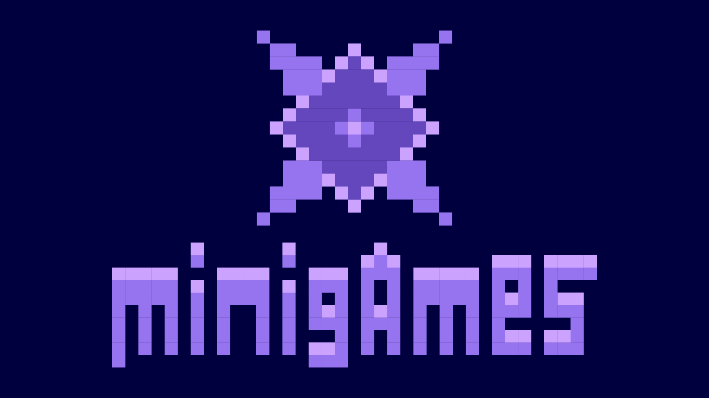
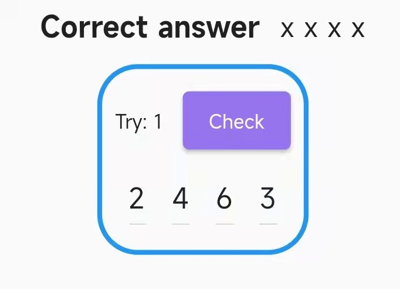
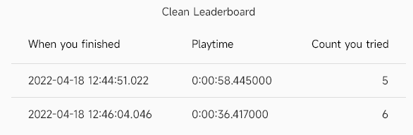
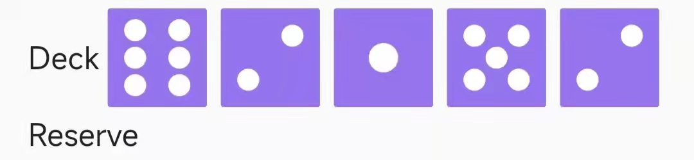

    
    
    
    
    

Mini games collection written in Dart & Flutter! 

# Games
## Hit & Blow
Hit & Blow is inspired by Nintendo Switch's Clubhouse Games: 51 Worldwide Classics' Hit & Blow.

### Description
This is a game of guessing the hidden `n` numbers and positions, with the default `n` being 4. Select `n-2` numbers from 1 to n and place them in the positions, then press "Check" to check for correctness. Each position will be judged as "all correct" (indicated by colored check marks) or "half correct" (indicated by grey check marks), the number of former is the number of correct positions and numbers, the number of latter is the number of correct numbers. If it fails, you can try again until you get it right! 

### Leaderboard
Currently Hit & Blow has a leaderboard powered by [Hive Flutter](https://docs.hivedb.dev/). It contains time when finished, playtime and count you tried, sorted by count you tried. 

### Further Objects
- Minor UI changes
- Bug fixes

## Guess Arrangement (猜排列)
A card guessing game inspired by deduction-style board games.

### Description
Two players each draw 8 cards from a standard 52-card deck and arrange them face-down from low to high (A=1, K=13). Players take turns guessing their opponent's cards by position and rank. 

**Gameplay:**
- Guess a card: "Position 3 is a 7" (only guess the rank, not the suit)
- Correct guess: The card is revealed, you continue guessing and build your combo
- Wrong guess: Turn passes to opponent, your combo resets
- Win condition: First player to reveal all opponent's cards wins

**Game Modes:**
- **2 Players**: Local multiplayer with turn switching and card hiding
- **Easy AI**: Random guessing strategy
- **Medium AI**: Rule-based deduction with position awareness
- **Hard AI**: Heuristic search with probability analysis

### Features
- Animated card flip effects
- Combo tracking system
- Round summary for AI turns
- Persistent game records

## Yacht Dice
Simple Dice Game inspired by Nintendo Switch's Clubhouse Games: 51 Worldwide Classics' Yacht Dices.

### Description
It's a game of throwing dices at each other to make permutations and compete for points. If you make a good combination, double tap the corresponding score to confirm the score. The selected permutations cannot be selected again. You can tap on the dice once, save only the good ones and roll them again. The remaining dice can also be changed after a re-roll. Each sheet's cell must be filled in, even if there are no permutations. The one with the highest score wins!

### Further Objects
- Leaderboard
- Versus AI
- More players

## 2048
Classic tile-sliding puzzle game.

### Description
Slide tiles in four directions to merge tiles with the same number. When two tiles with the same number collide, they merge into one tile with double the value. Try to reach the 2048 tile!

**Gameplay:**
- Swipe up, down, left, or right to move all tiles
- Tiles with the same number merge when they collide
- Each move spawns a new tile (90% chance of 2, 10% chance of 4)
- Game ends when no more moves are possible

**Scoring System:**
- Base points = merged tile value (e.g., merging two 4s gives 8 points)
- Multiple merges in one swipe: ×1.5 bonus
- Consecutive merge swipes: ×2 bonus

**Features:**
- Animated tile sliding and spawning effects
- Up to 5 save slots
- Best score tracking
- Game timer
- Light/Dark theme support

# Used Libraries & Materials
- [Flutter](https://flutter.dev)
- [Dart](https://dart.dev)
- [Flame](https://flame-engine.org)
- [Riverpod](https://riverpod.dev)
- [Drift](https://drift.simonbinder.eu)
- [flutter_intl](https://pub.dev/packages/flutter_intl)

# Technology Stack

| Layer | Technology |
|-------|------------|
| UI/Game Engine | Flame 1.36+ |
| State Management | Riverpod |
| Database | Drift (SQLite) |
| Localization | flutter_intl |
| Framework | Flutter 3.27+ |
| Language | Dart 3.6+ |

# Platform Support

| Platform | Status |
|----------|--------|
| Android | ✅ Supported |
| iOS | ✅ Supported |
| Web | ✅ Supported |
| Windows | ✅ Supported |
| Linux | ✅ Supported |
| macOS | ✅ Supported |

All games run offline with no network dependencies.